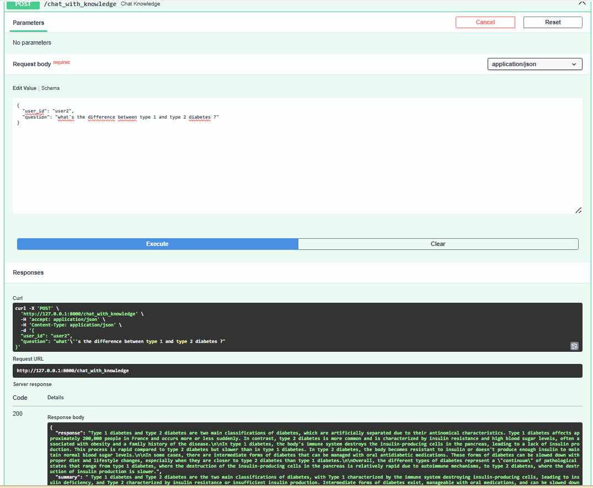

# AI Knowledge Chatbot

An AI-powered conversational chatbot with knowledge retrieval, summarization, and persistent memory. Built with **FastAPI**, **LangChain**, **FAISS**, **MongoDB**, and **OpenRouter AI**, it supports answering user queries, leveraging PDF/document knowledge, and providing concise summaries.

## Screenshot

  

## Features
- Conversational AI with memory
- Knowledge-based chat using a FAISS vector store
- PDF/document ingestion for domain knowledge
- Automatic summarization of answers
- Stores conversations and summaries in MongoDB

## Technologies Used
- **Backend:** Python, FastAPI
- **AI Models:** OpenRouter AI (Mistral-7B-Instruct)
- **Vector Database:** FAISS with HuggingFace embeddings
- **Document Handling:** PDF loading & text splitting
- **Database:** MongoDB
- **Environment:** dotenv for managing API keys
